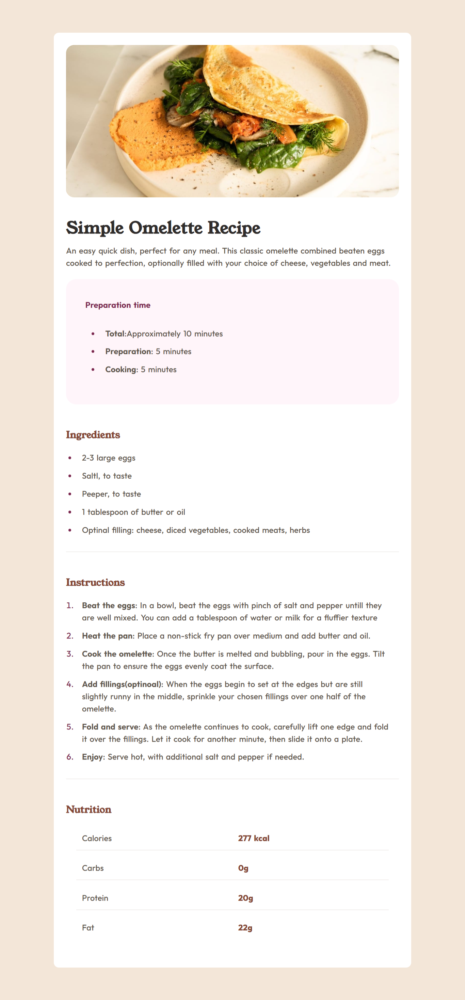

# Frontend Mentor - Recipe page solution

This is a solution to the [Recipe page challenge on Frontend Mentor](https://www.frontendmentor.io/challenges/recipe-page-KiTsR8QQKm). Frontend Mentor challenges help you improve your coding skills by building realistic projects. 

## Table of contents

- [Overview](#overview)
  - [The challenge](#the-challenge)
  - [Screenshot](#screenshot)
  - [Links](#links)
- [My process](#my-process)
  - [Built with](#built-with)
  - [What I learned](#what-i-learned)
  - [Continued development](#continued-development)

- [Author](#author)

**Note: Delete this note and update the table of contents based on what sections you keep.**

## Overview

### Screenshot

### Links

- Solution URL: [https://github.com/omlan99/recipe_page]
- Live Site URL: [https://omlan99.github.io/recipe_page/]

## My process

### Built with

- Semantic HTML5 markup
- CSS custom properties
- Flexbox

### What I learned
1. Common coding in stylesheet
2.Using list padding to customize the look of a style.
  ul,ol{
      padding: 1.25rem;
  }

### Continued development

Maybe it can be pixel perfect according to design. I designed it now with assumption and refrences from other projects.

## Author

- Frontend Mentor - [@omlan99](https://www.frontendmentor.io/profile/omlan99)
- Twitter - [@omlan99](https://www.twitter.com/omlan99)
- Linkedin - [@omlan99](https://www.linkedin.com/in/omlan99/)

